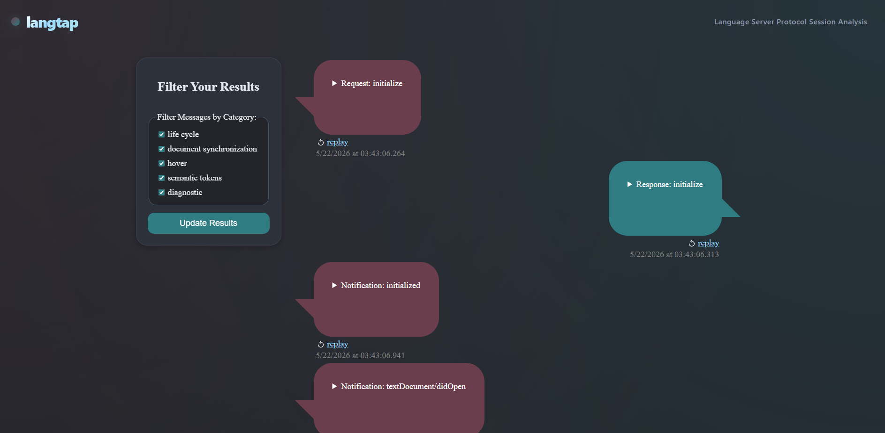

# Langtap

Langtap is a language server proxy intended to intercept traffic between your language server and language client. It will log and maintain a PostgreSQL database of every request that it receives, along with any protocol errors its validation catches. This lets you stand up a language server observability solution without building all of the logging infrastucture yourself.

Langtap also offers some notable language server debugging features. These include:
- protocol verification
    - langtap logs all protocol violations and will even intervene if traffic is breaking LSP spec compliance. For example, if a client sends a request that is not permitted before the initialize handshake, langtap will intervene and respond with a server not initialized error code.
- language server protocol conversation replay
    - langtap can replay a conversation back to the language server to replicate bugs.



## Getting Started

### Docker Setup

Langtap supports dockerization, so the easiest way to get started is to stand up a docker instance. You can find an example docker-compose.yml located at ./docker-compose.yml. You can use this compose file as-is, but you may want to consider changing the port mappings to something easier to remember. You will also need to create a .env file with the following:

```text
// this should point at your language server's exposed URL.
// In production, I recommend using the `wss://` protocol
// instead of `ws://` (this is similar to `https://` vs
// `http://` if you are unfamiliar with websockets).
forward_url="wss://192.168.0.31:8081"

// This is the name of the database that langtap will log into.
// I recommend keeping this as "langtap" for clarity.
POSTGRES_DB="langtap"

// change this to your postgres user's user name
POSTGRES_USER="example"

// change this to your postgres user's password
POSTGRES_PASSWORD="changeme"

// Slightly non-standard: langtap binds to 2 different ports.
// 1. the websocket (ws) port
// 2. the http port
// This allows you to avoid port-forwarding your http debugging
// website traffic accidentally. I recommend reverse-proxying
// (or port-forwarding) traffic to only the websocket port.
ws_port="8082"
http_port="8080"
```

Once you have this .env file configured, run `docker compose up` to spin up the API server and PostgreSQL database. When you first launch, the API server will fail to boot. This is because we need to create its database (if you'd like to segment it).
